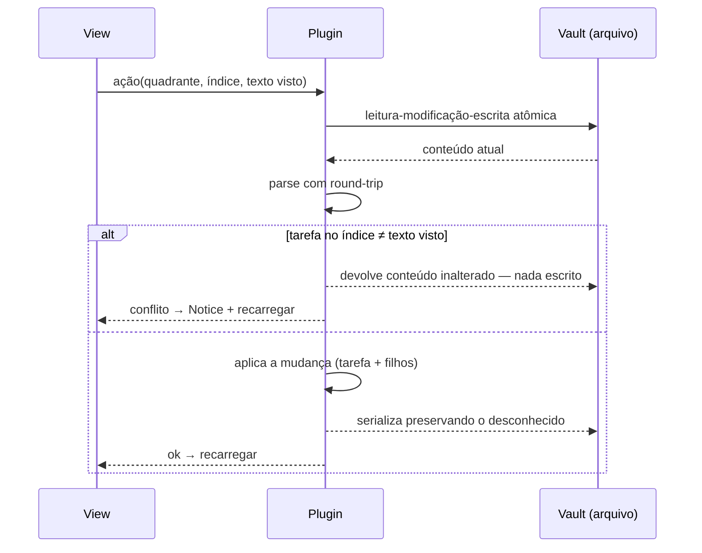

# Eisenhower Matrix: UX para a comunidade

> Planeje a partir deste documento. Cada slice abaixo traz o próprio formato: copie, não re-derive.
> Status: confirmado por Amador Rosa, 2026-09-26

## Situation

- Project: em uso. Publicado na loja de community plugins do Obsidian, 802 downloads, todos na 1.0.0.
- Decision: aberta, confirmada nesta discovery.
- In flight: nada em andamento. Segue como precedente o `MoveTaskModal`, que já pede data e pessoa ao mover. Ficam fora a matriz como vista do vault inteiro e a rotina de revisão, que são decisões futuras.
- At stake: a UI é barata de reverter. O formato e a escrita do arquivo de dados não são, porque são tarefas reais de ~800 pessoas, e um erro ali apaga conteúdo de terceiros.

## Problem

Quem baixou o plugin está recebendo menos do que o README promete, e às vezes perde dados sem saber. O artefato publicado na 1.0.0 é anterior a 12 melhorias já commitadas (drag & drop, settings, alertas de atraso, modal de mover), então nenhum usuário tem essas features. No código publicado e no atual, cada ação reescreve o arquivo inteiro e apaga o que a pessoa escreveu à mão: sub-itens, notas, propriedades do frontmatter. A view não percebe mudanças externas, e um sync do celular é sobrescrito no clique seguinte. No mobile, que o manifesto declara suportado, não dá para mover tarefa. Adicionar tarefa exige abrir a view e clicar com o mouse. Links e tags na tarefa aparecem como texto morto. As datas usam UTC, então no Brasil, depois das 21h, "Tomorrow" vira depois de amanhã.

Não medido: são 0 issues e nenhum feedback por outro canal. Isso reflete a falta de canal, não que o problema seja pequeno. O único número disponível é o de adoção: 802 downloads em 6 meses, ~130/mês (`community-plugin-stats.json`).

## Success

- Worked if: até 60 dias depois do release 1.2.0, nenhuma issue de perda de dados ou de "não funciona no mobile", e downloads acima de ~130/mês.
- Going wrong: uma issue reportando tarefa ou texto sumido depois de atualizar, ou downloads da 1.2.0 abaixo do ritmo da 1.0.0 no primeiro mês.
- Review: 60 dias após o release 1.2.0 - Amador Rosa, olhando `community-plugin-stats.json` e as issues do repositório.

## Boundary

In: release do que já existe; o arquivo de dados preservar o que o plugin não entende; a view refletir o arquivo; todas as ações da tarefa por toque; captura de tarefa de qualquer lugar; links, tags e sub-itens visíveis na tarefa.

Out:
- Tarefas de outras notas do vault na matriz: é outra relação com o vault e merece discovery própria.
- Rotina de revisão e arquivamento de concluídas: ninguém pediu ainda.
- Prazo em quadrantes além de Schedule: não entrou nesta rodada.
- Editar tarefa concluída: não entrou nesta rodada.
- Arrastar por toque: custo alto e frágil no scroll do mobile; o menu cobre a necessidade.
- Enviar a linha da nota ativa para a matriz: abre a pergunta "move ou linka", que não foi respondida.
- Tradução da UI: sem sinal de demanda.

Unchanged: o formato de linha da tarefa (`- [ ]`, `📅 YYYY-MM-DD`, `👤 nome`), os quatro cabeçalhos de quadrante, a setting de arquivo de dados, a setting de auto-complete de Eliminate e o comando `Open Eisenhower Matrix`.

## Shape

O arquivo de dados continua sendo a única fonte da verdade, e o que muda é a forma de lê-lo e escrevê-lo. Toda linha que o plugin não reconhece faz round-trip intacta; as linhas indentadas pertencem à tarefa acima delas; toda escrita é read-modify-write sobre o conteúdo atual. A porta de mão única é essa escrita: um erro nela apaga dados de usuários que não conseguimos contatar. As features de UX ficam em cima dessa base e são reversíveis.

Um editor cirúrgico, que altera só as linhas tocadas, só venceria se os usuários reestruturassem o arquivo além de sub-itens e notas soltas, e nada indica isso.

## Key decisions

1. **O arquivo vence.** A view não mantém estado de tarefa que o arquivo não tenha. Quando o arquivo muda por edição ou sync, a view recarrega a partir dele. O estado efêmero de UI (texto sendo digitado, toggles, esconder concluídas) sobrevive ao recarregamento.
2. **Uma escrita nunca apaga o que não entende.** Frontmatter, texto fora das listas e linhas indentadas sob uma tarefa voltam ao arquivo intactos. Mover ou excluir uma tarefa leva os filhos junto. O placeholder `*No tasks*` é a única linha que o plugin pode descartar.
3. **Uma ação altera só a tarefa em que o usuário tocou.** A escrita relê o arquivo atual e confere que a tarefa no endereço clicado é a mesma que a view mostrava. Se não for, a ação é abortada sem escrever nada e a view recarrega. Não copiar o padrão atual, que carrega, altera por índice e grava sem conferir.
4. **O formato do arquivo não muda.** Um arquivo escrito pela 1.0.0 é lido pela 1.2.0 sem migração. Uma ação sobre ele produz diff só nas linhas da tarefa afetada.
5. **"Hoje" é a data local do usuário** em todo lugar: botões rápidos, limite do seletor, validação de data passada e alerta de atraso.
6. **Sem arrastar por toque.** Mover, editar e excluir no mobile passam pelo menu nativo do Obsidian. O arrastar continua só no desktop.
7. **O `minAppVersion` sobe** para a primeira versão do Obsidian com escrita atômica de arquivo e render de markdown por plugin (a conferir nas anotações de versão da API). Quem estiver num Obsidian mais antigo para de receber atualizações.

## Work

| Slice | Delivers | Status |
|---|---|---|
| [Release 1.1.0](#release-110) | O código atual e datas locais publicados na loja | clear |
| [Round-trip file](#round-trip-file) | O arquivo de dados preserva o que o plugin não entende | clear |
| [Live reload](#live-reload) | A view reflete o arquivo sem reabrir | clear |
| [Task menu](#task-menu) | Toda ação da tarefa acessível por toque | clear |
| [Quick capture](#quick-capture) | Comando para adicionar tarefa de qualquer lugar | clear |
| [Rendered task](#rendered-task) | Links, tags e sub-itens visíveis e clicáveis | open — 1 default taken |

Order: Release 1.1.0 → Round-trip file → Live reload → (Task menu, Quick capture, Rendered task em qualquer ordem). Rendered task depende de Round-trip file.

Already handled by existing code: mover para Schedule/Delegate pede data ou pessoa → `MoveTaskModal`; excluir pede confirmação → menu de exclusão atual; tarefa atrasada destacada → alerta de atraso atual (corrigido pela Key decision 5).

Derivable from the repository, left to the plan: textos da UI em inglês, prefixo de classe `eisenhower-`, mensagens e estilo de erro de validação, chips de autocomplete de pessoa, botões rápidos de data. Tudo como o form principal e o `MoveTaskModal` já fazem.

### Release 1.1.0

**Delivers** o código atual com as datas locais (Key decision 5) publicado para os usuários atuais. **Status: clear.**

| State | What should happen |
|---|---|
| 22h em UTC-3, "Tomorrow" | a data é amanhã no calendário local |
| Tarefa com data igual a hoje local | não aparece como atrasada |
| Release publicado | o artefato baixável é byte a byte igual ao código da tag |
| Usuário na 1.0.0 atualiza | o arquivo de dados abre sem mudança |

### Round-trip file

**Delivers** leitura e escrita do arquivo de dados que não perdem conteúdo (Key decisions 2, 3, 4). **Status: clear.** É a porta de mão única.

| State | What should happen | Caller sees |
|---|---|---|
| Tarefa com sub-itens marcada como feita | sub-itens continuam sob ela | tarefa riscada |
| Tarefa com sub-itens movida | sub-itens vão junto para o novo quadrante | tarefa no novo quadrante |
| Tarefa com sub-itens excluída | sub-itens excluídos junto | tarefa some |
| Parágrafo ou callout entre seções | continua no mesmo lugar depois de qualquer ação | nada |
| Frontmatter com propriedades extras | preservado byte a byte | nada |
| Arquivo inexistente | criado com o esqueleto padrão atual | matriz vazia |
| Arquivo mudou e a tarefa no endereço clicado é outra | nada é escrito | Notice "Matrix changed — refreshed", view recarregada |
| Seção com `*No tasks*` recebe tarefa | o placeholder sai | tarefa aparece |

Alternatives considered: endereçar a tarefa por um id escrito no arquivo - vence se a conferência por texto gerar conflitos falsos com tarefas duplicadas, mas custa poluir o markdown de todo usuário.

### Live reload

**Delivers** uma view que acompanha o arquivo de dados (Key decision 1). **Status: clear.**

| State | What should happen |
|---|---|
| Arquivo editado em outra aba | a view atualiza em menos de 1s |
| Sync traz mudança de outro dispositivo | idem |
| Usuário digitando no input ou editando inline | o texto em edição não se perde; o recarregamento espera o fim da edição |
| Arquivo apagado ou renomeado | quadrantes vazios; a próxima ação recria o arquivo no caminho configurado |
| Caminho do arquivo alterado nas settings | a view passa a acompanhar o novo arquivo |

### Task menu

**Delivers** todas as ações da tarefa num menu acessível por toque (Key decision 6). **Status: clear.**

| State | What should happen |
|---|---|
| Toque no controle de ações do card (sempre visível em telas de toque) | menu com Move to (os outros três quadrantes), Edit e Delete |
| Move to Schedule ou Delegate | abre o `MoveTaskModal` existente |
| Delete | exclui depois da confirmação existente |
| Toggles Urgent e Important no mobile | área de toque de pelo menos 44px |
| Desktop | arrastar e os controles no hover continuam como hoje |

### Quick capture

**Delivers** o comando `Add task to Eisenhower Matrix`, que adiciona uma tarefa sem abrir a view. **Status: clear.**

| State | What should happen |
|---|---|
| Comando executado | modal com texto, quadrante escolhido por teclado (1–4 ou Urgent/Important) e o preview de destino |
| Quadrante Schedule ou Delegate | pede data ou pessoa, com as mesmas validações do form principal |
| Enter com texto vazio | nada acontece |
| Enter válido com a view fechada | tarefa salva, Notice de confirmação, a nota ativa não muda |
| Enter válido com a view aberta | a tarefa aparece na view (Live reload) |
| Sem hotkey padrão | o usuário define a sua; o comando aparece na command palette e na toolbar mobile |

### Rendered task

**Delivers** o texto da tarefa renderizado como markdown do Obsidian, e os sub-itens visíveis no card. **Status: open — 1 default taken.**

| State | What should happen |
|---|---|
| `[[Nota]]` no texto | abre a nota; hover preview no desktop |
| `#tag` no texto | abre a busca pela tag |
| Tarefa com sub-itens | o card mostra o contador recolhido; expandir mostra os sub-itens renderizados |
| Editar inline uma tarefa com link | o input mostra o markdown cru |

1. Clique no texto de uma tarefa que tem link - clique no link ou tag navega; clique no resto do texto edita.

## Migration

Nenhuma migração de dados (Key decision 4). A ordem de deploy é 1.1.0 primeiro, sozinha, para que a correção de datas e as features existentes cheguem sem somar risco à escrita nova. A 1.2.0 só depois de o round-trip passar nos arquivos de fixture: um da 1.0.0, um com sub-itens, um com notas soltas e um com frontmatter customizado. Um usuário que continuar na 1.1.0 lê normalmente um arquivo escrito pela 1.2.0, porque o formato é o mesmo, mas ainda apaga o conteúdo desconhecido quando escreve. Isso é o comportamento atual, não uma regressão. Quem estiver num Obsidian abaixo do novo `minAppVersion` fica na 1.1.0 (Key decision 7).

## Sources

- `community-plugin-stats.json` do repositório obsidianmd/obsidian-releases: 802 downloads, todos na 1.0.0.
- Release 1.0.0 no GitHub: o `main.js` publicado é igual ao do commit anterior às 12 melhorias.
- Documentação da API do Obsidian (obsidianmd/obsidian-api): escrita atômica em arquivo, `MarkdownRenderer.render`, ciclo de vida de `Component`.
