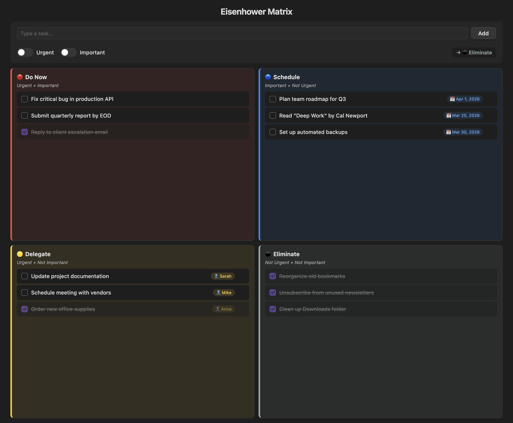

  

<h1 align="center">Eisenhower Matrix — Obsidian Plugin</h1>

  Organize your tasks by <strong>urgency</strong> and <strong>importance</strong> using the Eisenhower Matrix — directly inside <a href="https://obsidian.md">Obsidian</a>.

  
  
  

---

## Overview

The **Eisenhower Matrix** (also known as the Urgent-Important Matrix) helps you decide and prioritize tasks by sorting them into four quadrants based on urgency and importance.

| Quadrant | Urgent | Important | Action |
|----------|--------|-----------|--------|
| 🔴 **Do Now** | ✅ | ✅ | Execute immediately |
| 🔵 **Schedule** | ❌ | ✅ | Plan a date |
| 🟡 **Delegate** | ✅ | ❌ | Assign to someone |
| ⚫ **Eliminate** | ❌ | ❌ | Drop or defer |

## Features

- **Toggle-based input** — flip the Urgent and Important switches and the task is automatically routed to the correct quadrant
- **Smart contextual fields** — Schedule tasks prompt for a due date 📅, Delegate tasks prompt for an assignee 👤
- **Markdown persistence** — all tasks are saved as a readable `Eisenhower Matrix.md` file in your vault, fully compatible with search, backlinks, and Dataview
- **Works everywhere** — fully functional on both desktop and mobile

## How to Use

1. Click the **grid icon** in the ribbon (or use the command palette: `Open Eisenhower Matrix`)
2. Type your task in the input field
3. Toggle **Urgent** and/or **Important** to select the target quadrant
4. Click **Add** or press <kbd>Enter</kbd>
5. Check off completed tasks ✓ or remove them with ✕

## Installation

### From Community Plugins *(pending approval)*

1. Open **Settings → Community plugins → Browse**
2. Search for **"Eisenhower Matrix"**
3. Click **Install**, then **Enable**

### Manual Installation

1. Download `main.js`, `manifest.json`, and `styles.css` from the [latest release](https://github.com/oamadorr/eisenhower-matrix-obsidian/releases/latest)
2. Create a folder `.obsidian/plugins/eisenhower-matrix/` in your vault
3. Copy the 3 files into that folder
4. Enable the plugin in **Settings → Community plugins**

## License

[MIT](LICENSE) — free for personal and commercial use.

---

  Made with ❤️ by <a href="https://github.com/oamadorr">Amador Rosa</a>

